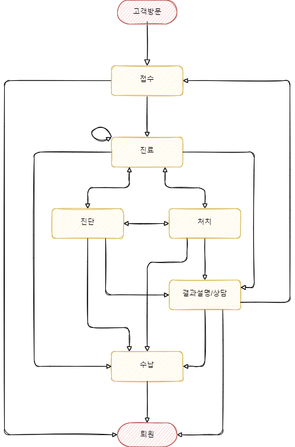

# IAMDT_TEST
아이엠디티 코딩테스트를 위한 프로젝트 입니다.

## 구현 중점
스태프의 권한이나 그룹 구성 등 기본적으로 들어갔을 법한 기능에 고민이 많았으나 \
과제 안내사항에 해당 기능에 대하여 별도 언급이 없었고 \
해당 사항 까지 구현하기에는 필요정보가 부족하여 **환자 상태 변화에만 집중하여 API를 구성**하기로 결정 하였습니다. \

### 환자의 진료내역 묶음
각 환자의 상태는 최초 접수를 기준으로 관리 하여 히스토리를 각 접수 별로 그룹핑 할 수 있도록 구성 하였습니다.

### API 기능 예상
1. 고객 관리
2. 환자 관리
3. 스태프 관리
4. 약품 관리
5. 의료 서비스 접수 관리
   1. 진료 단계(접수/진료/진단/처치/상담/수납/퇴원) 내역
   2. 각 단계별 관리
   3. 처방전 관리
   4. 결과 보고서 관리
6. 약품 관리

### API 단계별 흐름



# 패키지 설치 및 실행
python 3.10 버전에서 개발 및 테스트 되었습니다.

## 사용 python 패키지
1. Django
2. DjangoRestFramework
3. DRF-Spectacular
4. Django-Filter
5. Django-silk
6. Django-extensions
7. black

## 필요 패키지 설치
### poetry
```shell
proejct_root> poetry install --no-dev
# 혹은
proejct_root> poetry install
```

### pip
```shell
proejct_root> pip install -r requirements.txt
# 혹은
proejct_root> pip install -r requirements_dev.txt
```

## 실행

### Secret Key 파일 생성
`ProjectRoot`에 `.secrets/local.json` 파일을 넣어야 합니다. \
혹은 환경변수 `DJANGO_SECRET_PATH`로 파일경로를 설정합니다.
```shell
# Windows
set DJANGO_SECRET_PATH=path/local.json
# Linux
export DJANGO_SECRET_PATH=path/local.json
```

### 기본 데이터 세팅 
django `runserver`명령으로 로컬 기동시 기본 유저 데이터가 없으므로 초기 데이터 세팅이 필요합니다.
```shell
proejct_root/iamdt_django> python manage.py migrate # DB 마이그레이션
proejct_root/iamdt_django> python manage.py loaddata user customer patient medical_register medical_service medical_staff
```

### Test
```shell
proejct_root/iamdt_django> python manage.py test
```

### 실행 
```shell
proejct_root/iamdt_django> python manage.py runserver
# 별도 포트 지정
proejct_root/iamdt_django> python manage.py runserver 8080
```

### URL 접속

